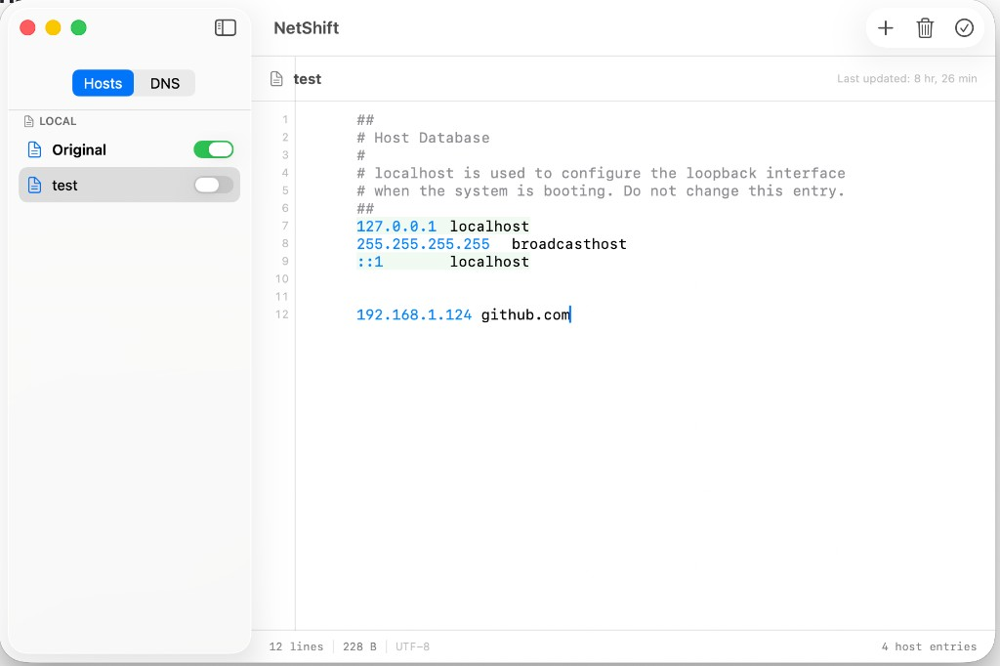
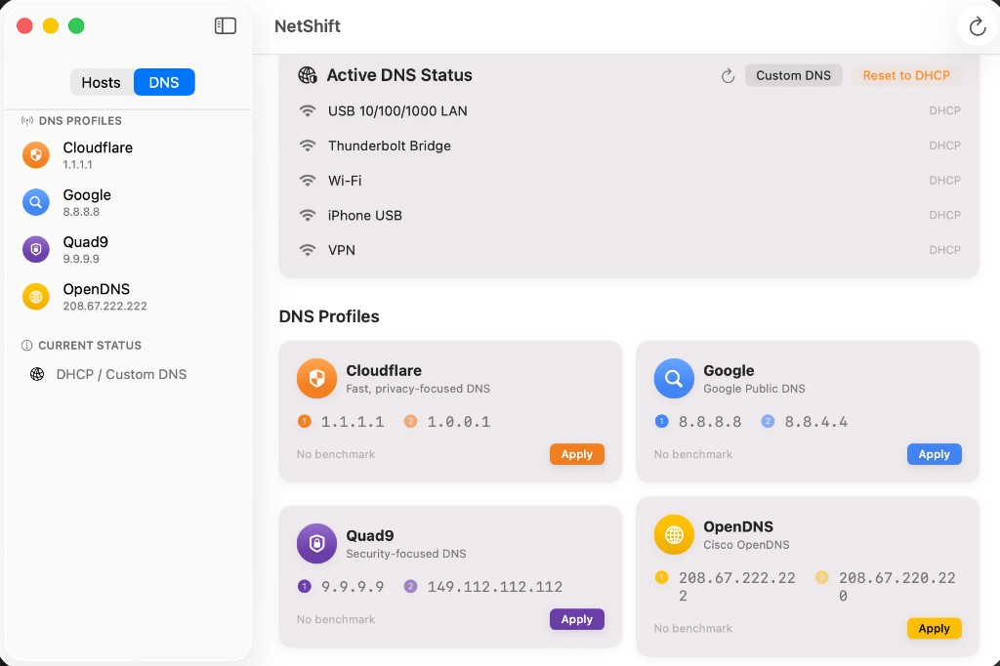
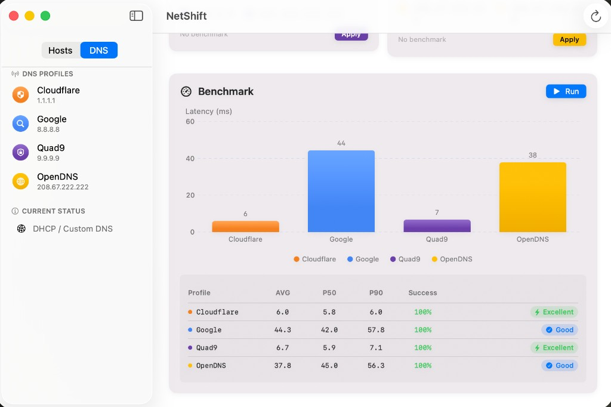
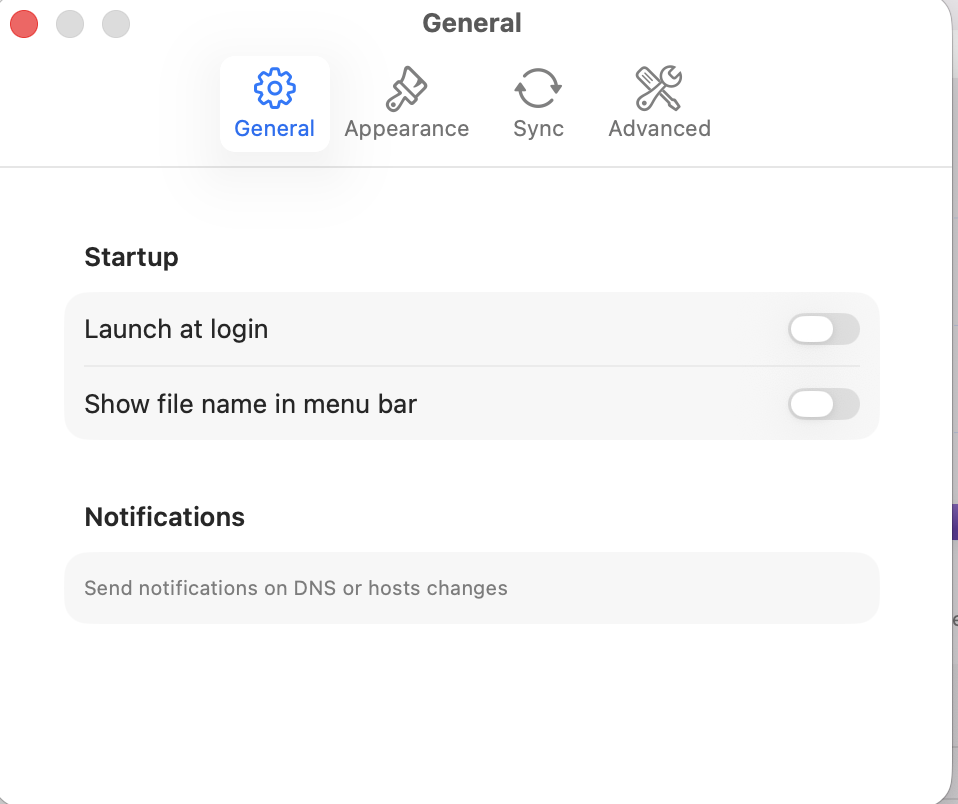

# NetShift

NetShift is a simple DNS and hosts file manager for macOS. It lets you edit hosts files, switch between them, and change DNS servers with a single click.

## Screenshots

| Hosts Editor | DNS Profiles |
|:---:|:---:|
|  |  |

| Benchmark | Preferences |
|:---:|:---:|
|  |  |

## System Requirements

Requires macOS 14 (Sonoma) or later.

## Download

[Download latest release (1.0.0)](https://github.com/musanmaz/netshift/releases)

## Installation

1. Download `NetShift-macos.zip` from [Releases](https://github.com/musanmaz/netshift/releases)
2. Unzip and drag `NetShift.app` to your Applications folder
3. **Important:** Since the app is not notarized, macOS may block it. To fix this, open Terminal and run:
   ```bash
   xattr -cr /Applications/NetShift.app
   ```
4. Launch NetShift and complete the one-time setup

## How It Works

### Hosts File Management
NetShift monitors the `/etc/hosts` system file and updates it with whichever hosts file you activate.

Your custom hosts files are stored in `~/Library/NetShift`.

### DNS Management
NetShift uses the macOS `networksetup` command to change DNS servers on all your network interfaces. It automatically flushes the DNS cache after each change.

### Application Log
The log file is located at `~/Library/Logs/DNS Helper.log`. Check this file when reporting issues.

## Usage Guide

NetShift typically runs in the background. It adds an icon to the menu bar — from there you can access the main editor window and quickly switch between hosts files and DNS profiles.

### Main Editor

The main editor consists of three parts: the **toolbar**, the **hosts file list** on the left, and the **file editor** on the right. By default, you'll find a file called **Original** under the "Local" section, which is a copy of your original `/etc/hosts` file.

### Hosts/DNS Switching

Use the segmented control at the top of the editor window to switch between the **Hosts** and **DNS** panels.

### Creating Files

Click the **Create (+)** button in the toolbar to add a new file, then choose the file type (Local, Remote, or Combined).

### Deleting Files

Select a file and click the **Delete** button in the toolbar.

### Activating Files

Select a file and click the **Activate** button, or choose it from the menu bar icon. NetShift will update `/etc/hosts` with the activated file's content. The active file is shown with a checkmark in the list.

## Hosts File Types

### Local Files
Local files that you can freely edit.

### Remote Files
Files that NetShift downloads and syncs from remote URLs. You can adjust the update frequency in Preferences or force an update from the menu bar. These files cannot be edited since they are overwritten on updates.

### Combined Files
A standout feature of NetShift. A combined file contains a list of local and remote files rather than hosts entries. When activated, the contents of all child files are merged and applied together.

## DNS Profiles

| Profile | Primary DNS | Secondary DNS | Description |
|---------|------------|---------------|-------------|
| Cloudflare | 1.1.1.1 | 1.0.0.1 | Fast, privacy-focused DNS |
| Google | 8.8.8.8 | 8.8.4.4 | Google Public DNS |
| Quad9 | 9.9.9.9 | 149.112.112.112 | Security-focused DNS |
| OpenDNS | 208.67.222.222 | 208.67.220.220 | Cisco OpenDNS |

Custom DNS servers can also be entered from the DNS panel.

## DNS Benchmark

Compare the performance of all profiles from the **Benchmark** section in the DNS panel. Average, P50 and P90 latency values along with success rates are displayed.

## Keyboard Shortcuts

| Shortcut | Action |
|----------|--------|
| Cmd+N | Create new file |
| Cmd+Shift+A | Activate selected file |
| Cmd+, | Preferences |
| Cmd+E | Open editor |
| Cmd+Q | Quit |

## Development

### Requirements
- Xcode 15 or later
- macOS 13+ SDK

### Build

Open the project with Xcode:

```bash
open Package.swift
```

Or build from the command line:

```bash
swift build
```

### Create App Bundle

```bash
./build-app.sh
```

### Create a Release

Build the app in release mode, zip it, and upload to GitHub:

```bash
swift build -c release
./build-app.sh
cd build && zip -r NetShift-macos.zip NetShift.app && cd ..
gh release create v1.0.0 build/NetShift-macos.zip --title "NetShift v1.0.0" --notes "Initial release"
```

## Project Structure

```
dns-helper/
├── DNSHelper/
│   ├── App/                # App entry point
│   ├── Models/             # Data models
│   ├── Services/           # Business logic services
│   ├── Views/              # SwiftUI views
│   │   ├── MenuBar/        # Menu bar
│   │   ├── Editor/         # Main editor window
│   │   ├── DNS/            # DNS management panel
│   │   ├── Preferences/    # Preferences
│   │   ├── Onboarding/     # First-run guide
│   │   └── Shared/         # Shared components
│   ├── Theme/              # Design system
│   └── Resources/          # Assets, Info.plist
├── legacy-go/              # Legacy Go CLI code (reference)
├── Package.swift           # Swift Package Manager
└── README.md
```

## Contributing

1. Fork the repository
2. Create a feature branch
3. Make your changes
4. Submit a pull request

## License

This project is licensed under the Apache License 2.0 — see the [LICENSE](LICENSE) file for details.

## Security

This app modifies system DNS settings and the `/etc/hosts` file. Admin password is required only once during initial setup. The helper tool only supports 4 specific commands and cannot execute arbitrary code.

---

**Developed by Mehmet Sirin Usanmaz** — [GitHub](https://github.com/musanmaz)
